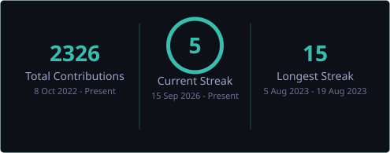
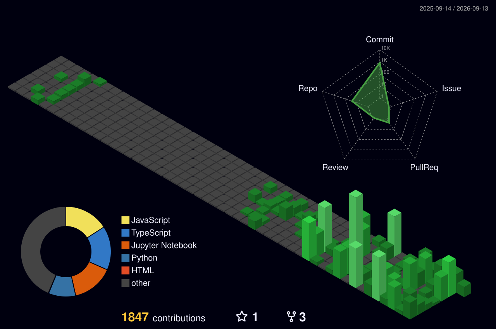

<div align="center">
  
</div>

<div align="center">
  <a href="https://PavinSP.github.io/portfolio"><b>Portfolio</b></a> &nbsp;·&nbsp;
  <a href="https://linkedin.com/in/pavin-sp"><b>LinkedIn</b></a> &nbsp;·&nbsp;
  <a href="mailto:pavinsp122002@gmail.com"><b>Email</b></a>
</div>

<br/>

```console
$ python train.py --model pavin --epochs inf

Epoch 1/∞  ━━━━╸─────────────────  loss: 1.842  acc: 0.412
          └─ 2022  B.Tech AI & Data Science · Anna University
Epoch 2/∞  ━━━━━━━━━╸────────────  loss: 0.914  acc: 0.690
          └─ 2023  Thesis: MoA prediction on GPU-XGBoost
Epoch 3/∞  ━━━━━━━━━━━━━╸────────  loss: 0.451  acc: 0.803
          └─ 2024  Cognizant trainee · 2 papers in TIJER
Epoch 4/∞  ━━━━━━━━━━━━━━━━━━╸───  loss: 0.186  acc: 0.915
          └─ 2025  M.Sc. Artificial Intelligence @ THWS
Epoch 5/∞  ━━━━━━━━━━━━━━━━━━━━━━  loss: 0.031  acc: 0.983
          └─ 2026  CellFoundry · ElevenLabs Sonderpreis

>>> EarlyStopping: patience exceeded — still improving, not stopping
>>> Checkpoint saved: Würzburg, DE · open to research & HiWi roles
```

<br/>

### Selected work

🏆 &nbsp;**[Teach It To Grandma](https://titanom-hackathon-8xts.vercel.app/)** &nbsp;·&nbsp; <sub>`ElevenLabs` `React` `LLM grading`</sub>
> Explain a topic aloud to one of six AI learner personas who push back on your jargon, then an LLM grading pass judges whether you *actually* explained it, or just said the words. **Winner of the ElevenLabs Sonderpreis**, Titanom Student Hackathon 2026.
> [live demo](https://titanom-hackathon-8xts.vercel.app/) · [code](https://github.com/PavinSP/titanom-hackathon)

🔬 &nbsp;**CellFoundry** &nbsp;·&nbsp; <sub>`Micro-SAM` `CellSAM` `microscopy`</sub>
> Benchmarking and fine-tuning vision foundation models for adipocyte instance segmentation in brightfield microscopy. *Ongoing — private repo.*

🏗️ &nbsp;**[SSOT — Single Source of Truth](https://github.com/PavinSP/SSOT---Single-Source-of-Truth)** &nbsp;·&nbsp; <sub>`zero-shot` `IFC/BIM` `Streamlit`</sub>
> Construction runs on scattered emails, chats and handwritten notes; the delays and cost claims buried in them get re-typed by hand. This intercepts that stream, categorizes it, and prepares one-click updates into project systems. Built at the **ConStructAI Hackathon** (CAIRO.thws) to a challenge set by Prof. Christian Hofmann.

🧬 &nbsp;**[GPU-Accelerated MoA Prediction](https://github.com/PavinSP/moa-prediction-thesis)** &nbsp;·&nbsp; <sub>`XGBoost` `CUDA` `multi-label`</sub>
> Predicting the mechanism of action of drug compounds — a multi-label classification pipeline on GPU-accelerated XGBoost. **Bachelor thesis**, code and full report.

🧠 &nbsp;**[SniffTest](https://github.com/PavinSP/SniffTest-DIAL-Hackathon)** &nbsp;·&nbsp; <sub>`DistilBERT` `FastAPI` `game`</sub>
> A six-level browser game that trains people to recognize manipulation tactics — loaded language, false choices, fake consensus — with a five-class classifier giving live feedback. Built at the **DAAD Hackathon**; I owned the web frontend and the backend APIs behind the detection model.

📄 &nbsp;**LLM Resume Screening** &nbsp;·&nbsp; <sub>`LangChain` `Azure OpenAI`</sub>
> Multi-step extraction pipeline turning unstructured CVs into structured records. **Published in TIJER**, Vol 11 Issue 7.

<br/>

<div align="center">
  
</div>

<br/>

<div align="center">
  
</div>

<br/>

<div align="center">
  <i>Open to research opportunities, HiWi positions, and hard problems in AI and infrastructure.</i>
</div>
